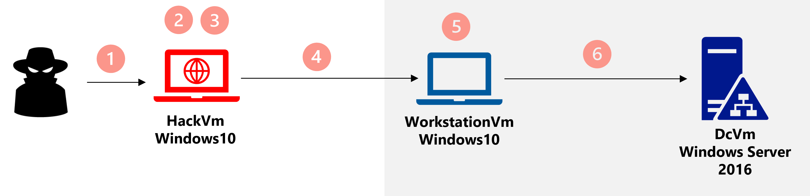

# MTT CoHack Challenge: Hacking-Game

## Introduction

In this challenge, we invite you to step into the role of a hacker. Your first objective will be to access to a corporate network by infiltrating a user's machine. Once you have gained access to this machine, your ultimate goal will be to gain control over the company's domain.

Are you ready? 

## Requirements

The CoHack lab platfrom consists of 3 VMs: HackVm (Windows10), WorkstationVm (Windows10) and DcVm (Windows Server 2016).
The platform is already deployed. To start hacking, you have to connect to HackVm using RDP connection. The IP address and credentials will be provided by the coach.  

## Learning Objectives

This hack will help you learning about:
- Network scanning 
- Brute force attack 
- Privilege escalation
- Pass the hash attack  

## Success Criteria

1. Connect to the HackVm using RDP. Your coach will provide you with the Public IP address and credentials.

2. Use a resource to discover the private IP address of the WorkstationVm.

3. Use a resource to find the login and password that will allow you to connect to the WorkstationVm using RDP.

4. Connect to the WorkstationVm using RDP and the login and password found in step 3.

5. Discover the IP address of the domain controller DcVm.  

6. Use a resource, (a) to find the login and password hash of the Domain Admin then (b) to connect to the domain controller using RDP.

  >**Note**: Each resource should be used one time  

## Resources

1. Mimikatz
    - https://github.com/ParrotSec/mimikatz
    - https://techyrick.com/mimikatz-tutorial/
    - https://edermi.github.io/post/2018/native_rdp_pass_the_hash/

2. Nmap 
    - https://nmap.org/download.html

3. Hydra 
    - https://github.com/maaaaz/thc-hydra-windows
    - https://securitytutorials.co.uk/brute-forcing-passwords-with-thc-hydra/
    - https://github.com/adeldjama/Hacking-Game/blob/37fa336979bbdabf53f53ce07d7832900f47b2c4/resources/username.txt
    - https://github.com/adeldjama/Hacking-Game/blob/37fa336979bbdabf53f53ce07d7832900f47b2c4/resources/password.txt

